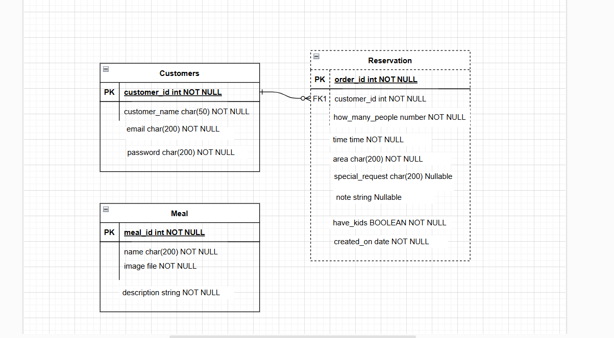
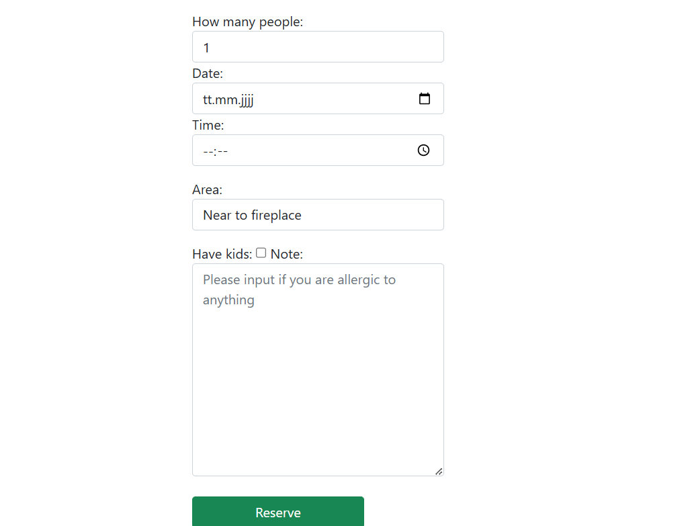

# Resturant booking table
Easy Online Table Reservation: Booking a table has never been easier! With our user-friendly online reservation system, you can secure your spot at our restaurant in just a few clicks. Choose your preferred date, time, and party size, and let us handle the rest.

We believe that every meal is a celebration. Whether you're planning a romantic dinner, a family gathering, or a business lunch, our inviting atmosphere and exquisite menu are designed to create unforgettable dining experiences.
[Live production](https://resturant-booking-table-a5e049e05339.herokuapp.com/)

## Design
### Used color
* red #A80516 for background 
* green #198754 for buttons
* white #FFFFFF for text and icons
* black #198754 for text

## Entity Relation Diagram 
 

 

## Features
* Navbar
* In the navbar you user have three options 
    1. Home to move to home page where the reservation is found
    2. Resgiter to move to create an account
    3. Login to move to sign in
 

 

* A small introduction about the resturant 

 

* Images to show the guests of the resturant

 

 

* Menu here is the meal that the restaurant serve 
 

 

* Reservation: in this section customer can reserve a table in a specific date and time but customer must be logged in

 

 

* Follow us: hier can the customer follow us on social media Youtube - Instagram - Facebook - Twitter
 

 

* Register Page: here can customer create a new account 

 

 

* Login: here can customer login to create reservations or cancel ones
 

 

* After login : when customer loged in his username wiil be shown instead of Register and book a table link to move to reservation page

 

 
* If customer pressed of his username customer can see his/her reservations and they can cancel a reservation here

 

 

## Used languages :
---
* PYTHON 
* HTML 
* CSS 
* BOOTSTRAP

## Framework - Libraries - Tools
* Django
* cloudinary to upload images
* allauth to create user and login
* bootstrap to style pages
* gunicorn to host code on heroku
* whitenoise to handle static files
* VSCode was used as the main tool to write and edit code.
* Git was used for the version control of the website.
* GitHub was used to host the code of the website.

## Deployment
---

### To deploy the project to Heroku so it can be run as a remote web application
    1. Create a Heroku account if you don't already have one here [Heroku](https://dashboard.heroku.com/).
    2. Create a new Heroku application on the following page here New [Heroku App](https://dashboard.heroku.com/apps)
    3. Go to the Deploy tab
    4. Link your GitHub account and connect the application to the repository you created.
    5. Go to the Settings tab
    6. Click "Add buildpack"
    7. Add the Python and Node.js buildpacks in the following order
    8. Click Reveal Config Vars
    9. Add 1 new Config Vars
    10. Key: PORT    Value: 8000
        * This Config was provided by [CODE INSTITUTE](https://codeinstitute.net/de/).
    11. Click Deploy Branch
    12. Click View to launch the application inside a web page.
* To clone the project
    1. On GitHub, navigate to the main page of the repository.
    2. Above the list of files, click <> Code.
    3. Copy the URL for the repository.
        * To clone the repository using HTTPS, under "HTTPS", click .
        * To clone the repository using an SSH key, including a certificate issued by your organization's SSH certificate authority, click SSH, then click .
        * To clone a repository using GitHub CLI, click GitHub CLI, then click
    4. Open Git Bash
    5. Change the current working directory to the location where you want the cloned directory.
    6. Type git clone, and then paste the URL you copied earlier.
        git clone https://github.com/mohanadpro/resturant-booking-table.git
    7. Press enter
* To fork project
    1. On GitHub, navigate to the octocat/Spoon-Knife repository.
    2. Click Fork in the top right corner of the page .
    3. Under Owner, select the dropdown menu and then select an owner for the forked repository.
    4. By default, forks are given the same name as their upstream repositories. To further distinguish your fork, you can optionally enter a name in the "Repository name" field.
    5. Optionally, enter a description for your fork in the “Description” field.
    6. Optionally select Copy default branch only .
    7. Click Create Fork .

## Credits 
---
### Media
* Images : from https://www.google.com
### Code
* [W3C](https://validator.w3.org/) to validate written code
* [Stak over flow](https://stackoverflow.com/) to get information in coding
* [Am i responsive](https://ui.dev/amiresponsive) to see project in different screens
* [Diagrams](https://app.diagrams.net/) to create entity relation diagram