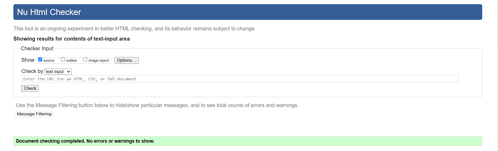
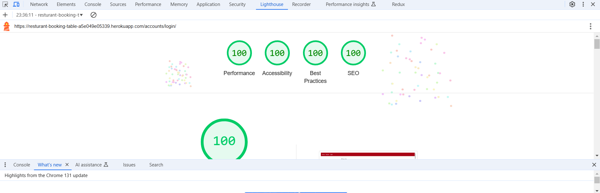

# Resturant booking table | Testing

Return to [README](README.md)
- - -
Comprehensive testing has been performed to ensure the website's seamless and optimal functionality.

## Table of Contents
### [Responsiveness Testing](#responsiveness-testing-1)
### [Browser Compatibility Testing](#browser-compatibility-testing-1)
### [Device Testing](#device-testing-1)
### [Code Validation](#code-validation-1)
* [HTML Validation](#html-validation)
* [CSS Validation](#css-validation)
* [JavaScript Validation](#javascript-validation)
* [Python](#python)
### [Lighthouse Report](#lighthouse-report-1)
### [Bugs](#bugs-1)
* [Resolved Bugs](#resolved-bugs)
* [Unresolved Bugs](#unresolved-bug)
### [Features Testing](#features-testing-1)

## Responsiveness Testing

## Browser Compatibility Testing
The project was tested on multiple web browsers to check for compatibility issues and ensure it functions as expected across all of them. This testing process guarantees a smooth and consistent user experience, regardless of the browser used.

 Chrome

 Microsoft Edge

 Opera

 Mozilla

## Device Testing

## Code Validation

### HTML Validation

 Home Page

 Login

 Reservation List

 Reserve

### CSS Validation

 Style.css

### JavaScript Validation

 reservation.js

### Python
#### Home page app

 views.py

 urls.py

#### Meal app

 model.py

 views.py

 urls.py

#### reservation app

 form.py

 model.py

 views.py

## Lighthouse Report

 Home Page

 Login

 Signup

 Reservation list page

 Reserve

## Bugs

### Resolved Bugs
#### Refused to apply style from Woodland Whispers site link because its MIME type(text/html).

* When I have deployed the site to Heroku for the first time, static files were not working, it was due to missing of whitenoise library, so I installed it and then deployed the project again. after that everything worked finally 

* styling reserve form was the the best so the checkbox was beside the note textarea I fixed that by adding the form inside a table tag

### Unresolved Bug

## Features Testing

| Page          | User Action   | Expected Result  | Notes            |
|---------------|---------------|------------------|------------------|
| Home Page     |               |                  |                  |
|               | Click on Home | Redirect to Home Page | PASS        |
|               | Click on Register button | Redirect to Sign Up page | PASS |
|               | Click on carousel control | Move left, move right | PASS |
|               | Click on social links in footer | Open new tab with appropriate link | PASS |
|               | Click on Login (Navigation bar) | Redirect to Login page | PASS |
| Home Page (Logged In - User)  |                 |          |  |
|               | After Login | Register button is now Book a table button | PASS |
|               | After Login | Login button is Logout button | PASS |
|               | After Login | User's username is displayed in navigation bar | PASS |
|               | Click on Book a table | Redirect to reservation page | PASS |
|               | Click on user's username after login | Redirect to Reservations Overview page | PASS |
|               | Click on Logout | Redirect to Logout Page | PASS |
| Register Page  |                  |                  |                  |
|               | Enter invalid email | Field will only accept email address format | PASS |
|               | Enter valid email | No error | PASS |
|               | Email field left empty | Email is optional | PASS |
|               | Type invalid password | Must contain atleast 8 char | PASS |
|               | Type valid password | No error | PASS |
|               | Type password again (different) | Password must be the same | PASS |
|               | Click Sign Up with empty form | Fill in the form fields | PASS |
|               | Click Sign In if you have an account | Redirect to Login page | PASS |
|               | Fill all the form fields with an existing username | A user with that username already exists,  alert message | PASS |
|               | Fill all the form fields | Account created, alert message that you Signed in and redirect to home page | PASS |
| Login Page  |                  |                  |                  |
|               | Click on Sign Up, if you don't have an account | Redirect to Sign Up page | PASS |
|               | Try invalid username or password | The username and/or password you specified are not correct. | PASS |
|               | Valid password and username | Logs in, message that you signed in | PASS |
|               | Click Sign In with empty form | Fill in the form fields | PASS |
| Logout Page  |                  |                  |                  |
|               | Click on Sign Out button | Sign user out, message that user signed out | PASS |
| Book a table page  |                  |                  |  
|                    | Try to choose number for how many people field below 1 and above 25 | Not accepted| PASS  
|                    | Click Reserve button without choosing date / time | Fill in the form fields, message is displayed | PASS  
|                    | Click Reserve button for date or time before the current time|"Date or time is invalid, you tried to reserve a table before current time" alert message will be displayed | PASS  
|                    | Fill the fields with valid data | Reservation added, alert message and redirect to reservaion list page | PASS
| Reservation list |                  |                  |  

